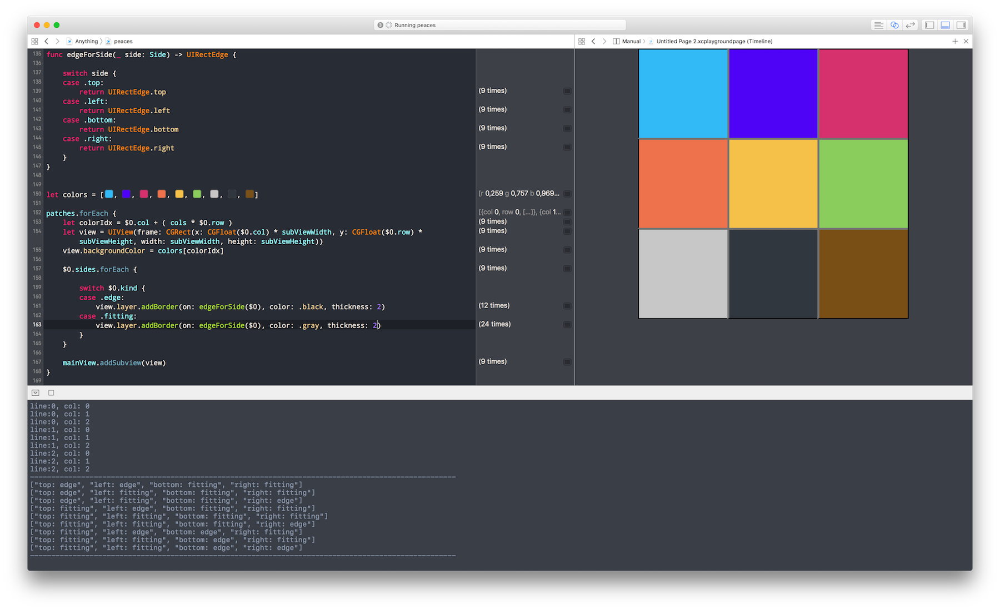

# Bonates Xcode Color Theme

Just a personal choice, where I spend most of my working time :D

## Installing

1. copy the file `DBO.xccolortheme`

2. then paste into this folder:

`~/Library/Developer/Xcode/UserData/FontAndColorThemes`

3. Then just restart the Xcode

[]'s

