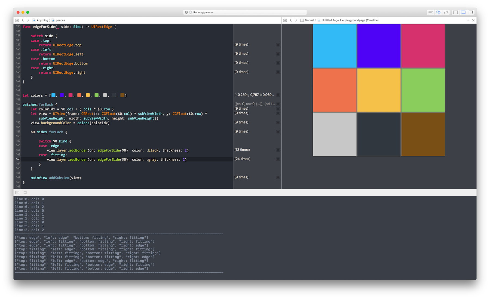
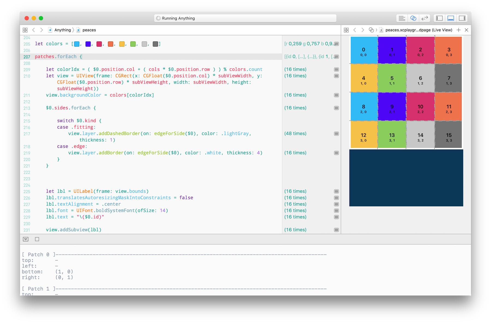

# Bonates Xcode Color Theme

Just a personal choice, where I spend most of my working time :D

## Installing

1. copy the file `DBO-light.xccolortheme` and `DBO-dark.xccolortheme`;

2. then paste into this folder:

`~/Library/Developer/Xcode/UserData/FontAndColorThemes`

3. double click on the font file `Droid Sans Mono for Powerline.otf` located on _font_ folder to install it;

4. Restart the Xcode.

[]'s

